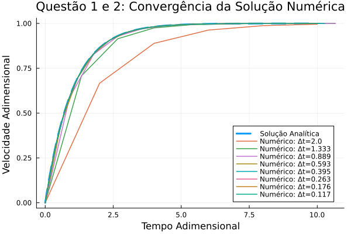
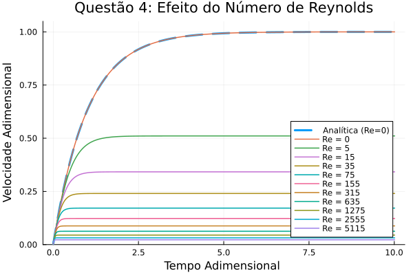
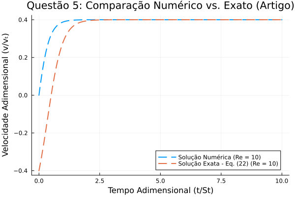

# Tarefa 1: Introdução e Dinâmica de Partículas (Julia)

[](https://colab.research.google.com/github/opdrin09/MNCM/blob/main/01_Tarefa_Intro/executar_tarefa_1.ipynb)

Esta tarefa aborda a simulação numérica do movimento de uma partícula esférica em queda livre em um fluido viscoso. O objetivo central é analisar a influência das diferentes forças de arrasto na velocidade da partícula ao longo do tempo.

## O Problema Físico

A dinâmica da partícula em queda é governada pelo balanço de forças: Peso, Empuxo e Arrasto. Em termos adimensionais, a equação de movimento é dada por:

$$
\frac{dv}{dt} = \frac{1 - v - \frac{3}{8} Re \cdot v^2}{St}
$$

Onde:
- $v$: Velocidade adimensional da partícula.
- $St$ (Número de Stokes): Parâmetro que caracteriza a inércia da partícula.
- $Re$ (Número de Reynolds): Quantifica a razão entre forças inerciais e viscosas.

### Regimes de Escoamento

1.  **Regime de Stokes ($Re \approx 0$):** Para partículas pequenas ou fluidos muito viscosos, o arrasto é linearmente proporcional à velocidade ($F_d \propto v$). Neste caso, a equação admite solução analítica exata: $v(t) = 1 - e^{-t/St}$.

2.  **Regime Não-Linear ($Re > 0$):** Com o aumento da velocidade ou tamanho da partícula, o arrasto quadrático torna-se relevante. A EDO torna-se não-linear, exigindo solução numérica.

## Instruções de Execução

### Opção 1: Google Colab (Recomendado)
Acesse o ambiente interativo diretamente no navegador através do badge abaixo:

[](https://colab.research.google.com/github/opdrin09/MNCM/blob/main/01_Tarefa_Intro/executar_tarefa_1.ipynb)

### Opção 2: Execução Local
Requer o ambiente Julia instalado:

```bash
julia tarefa_1.jl
```

## Resultados e Análise dos Gráficos

### Gráfico 1: Convergência do Método Numérico (Re = 0)


A linha tracejada preta representa a solução analítica exata. As linhas coloridas indicam as soluções numéricas obtidas via Runge-Kutta de 4ª ordem (RK4) com variados passos de tempo ($\Delta t$).

**Análise:**
- Para valores elevados de $\Delta t$ (ex: 2.0), observa-se uma discretização grosseira, desviando-se da curva exata.
- Com a redução de $\Delta t$ (1.33, 0.889, 0.593...), as curvas aproximam-se progressivamente da solução analítica.
- Para $\Delta t$ suficientemente pequeno (< 0.2), há sobreposição prática com a solução exata, evidenciando a precisão do método RK4.

**Conclusão:** O método apresenta consistência e convergência; a precisão é inversamente proporcional ao passo de tempo.

### Gráfico 2: Efeito do Número de Reynolds


Nesta análise, fixa-se $\Delta t = 0.01$ e varia-se o número de Reynolds de 0 a 5115. A referência (linha tracejada) permanece sendo a solução analítica para o regime linear unicamente para comparação.

**Análise:**
- Para $Re = 0$ (azul), a solução numérica coincide com o modelo de Stokes.
- Com o aumento de $Re$ (5, 15, 35, 75...), a velocidade terminal da partícula decresce significativamente.
- Para $Re = 5115$, a partícula atinge uma velocidade terminal muito reduzida.

**Justificativa Física:** O termo de arrasto quadrático ($\propto v^2$) cresce rapidamente com a velocidade. Elevados números de Reynolds implicam em forças de resistência aerodinâmica/hidrodinâmica maiores, limitando a velocidade máxima que a partícula pode atingir.

### Gráfico 3: Validação com Literatura


Este gráfico apresenta a comparação entre a solução numérica obtida (linha tracejada) e a solução analítica exata para o caso não-linear, conforme descrita na literatura (Sobral et al., Equação 22).

**Análise:**
- Verifica-se a sobreposição das curvas a partir de um certo ponto (cerca de 2 no tempo admensional), validando a implementação do método numérico para tal trecho.
- A parte inicial em que não há sobreposição indica uma provável diferença entre as condições de contorno adotadas pelos 2 modelos ou simplesmente uma complexidade a mais no modelo exato que considera melhor as escalas do problema, visto que apesar de haver divergência neste termo, a forma do gráfico ainda é a mesma. 


**Conclusão:** O código encontra-se validado e apto para simulações em diferentes regimes de Reynolds.
