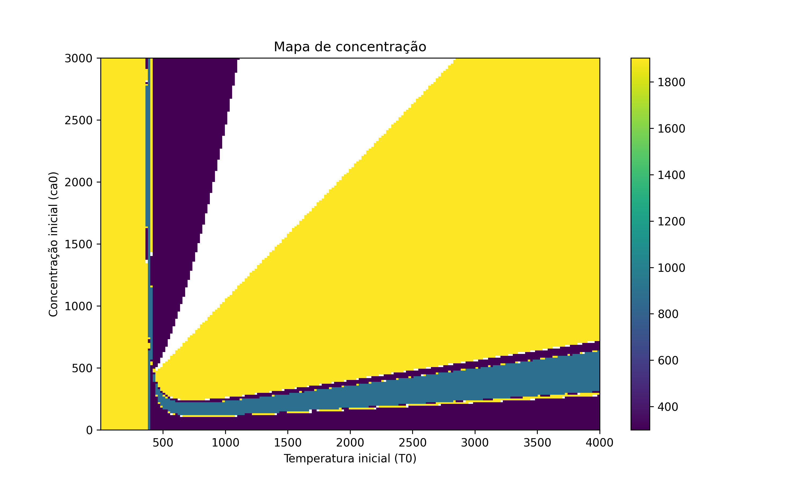
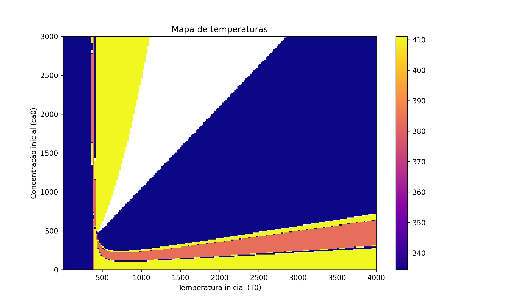

# Programa 2: Reator CSTR com Newton-Raphson

## Contextualização do Problema
O problema abordado neste programa envolve a análise de um reator químico CSTR (Continuous Stirred Tank Reactor), onde ocorrem reações exotérmicas. O objetivo é determinar os estados estacionários de concentração ($C_A$) e temperatura ($T$) do reator.

O sistema é modelado por um par de equações não-lineares acopladas que descrevem o balanço de massa e o balanço de energia no reator. A não-linearidade surge principalmente devido à dependência exponencial da taxa de reação com a temperatura (Lei de Arrhenius).

As equações governantes no estado estacionário são da forma:
1. **Balanço de Massa:**  $f_1(C_A, T) = 0$
2. **Balanço de Energia:** $f_2(C_A, T) = 0$

O método numérico de Newton-Raphson para sistemas é utilizado para encontrar as raízes simultâneas dessas equações ($C_A$ e $T$) a partir de estimativas iniciais. O programa também gera mapas de calor para visualizar como as soluções de equilíbrio (concentração e temperatura finais) variam em função das condições iniciais do sistema.

## Descrição

O código implementa o método de Newton-Raphson para resolver o sistema de balanço de massa e energia acoplado. Ele também gera mapas de calor (heatmaps) para visualizar como a convergência para diferentes estados estacionários depende das condições iniciais (Concetração inicial $Ca_0$ e Temperatura inicial $T_0$).

## Como Executar

Certifique-se de ter Python instalado com as bibliotecas `numpy` e `matplotlib`.

```bash
python reator_newton_raphson.py
```

O script rodará automaticamente, resolvendo para casos específicos e gerando os mapas de calor na pasta `images/`.

## Resultados

### Mapa de Concentração Final
Este mapa mostra a concentração final alcançada pelo reator para diferentes combinações de condições iniciais. Regiões de cores diferentes indicam convergência para estados estacionários distintos (multiplicidade).



### Mapa de Temperatura Final
Analogo ao mapa de concentração, mostra a temperatura final de equilíbrio.



## Dependências
- `numpy`
- `matplotlib`
