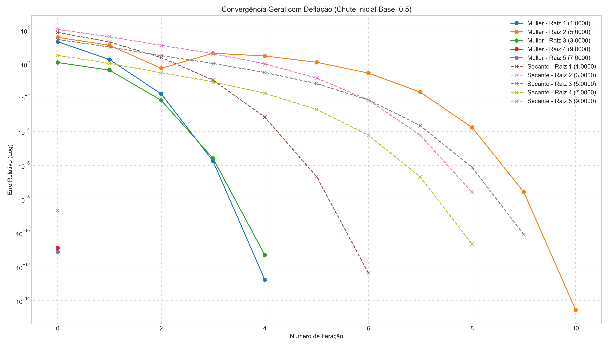

# Programa 3: Encontrando Raízes de Polinômios (Müller e Secante)

## Instruções de Execução
Requer Python 3 com as bibliotecas `numpy` e `matplotlib`.

```bash
python muller_secante.py
```

Os gráficos de convergência gerados serão salvos no diretório `images/`.

## Contextualização do Problema

O objetivo é determinar todas as raízes (zeros) reais do seguinte polinômio:

$$
P(x) = (x-1)(x-3)(x-5)(x-7)(x-9)
$$

As raízes analíticas são conhecidas ($x \in \{1, 3, 5, 7, 9\}$), servindo de base para validação dos métodos numéricos. O desafio consiste em localizar múltiplas raízes sequencialmente sem conhecimento prévio.

### Técnica de Deflação

Após a determinação de uma raiz $r_1$, utiliza-se a técnica de **deflação polinomial** para evitar que o algoritmo convirja novamente para a mesma solução. Divide-se o polinômio original pelo fator $(x - r_1)$, obtendo-se um novo polinômio reduzido:

$$
P_{novo}(x) = \frac{P(x)}{x - r_1}
$$

Este processo é repetido iterativamente para encontrar as raízes subsequentes ($r_2, r_3, \dots$).

**Observação:** A deflação introduz e propaga pequenos erros de arredondamento a cada etapa, podendo reduzir a precisão das últimas raízes encontradas.

## Métodos Numéricos

### Método de Müller
Utiliza uma aproximação parabólica baseada em **três pontos** ($x_{k-2}, x_{k-1}, x_k$) para estimar a próxima raiz.

*   **Característica:** Baseia-se na fórmula quadrática, permitindo localizar **raízes complexas** mesmo iniciando com estimativas reais (quando o discriminante é negativo).
*   **Convergência:** Ordem $\approx 1.84$ (superlinear).

### Método da Secante
Utiliza uma aproximação linear baseada em **dois pontos** ($x_{k-1}, x_k$).

*   **Vantagem:** Dispensa o cálculo analítico de derivadas, diferentemente do método de Newton-Raphson.
*   **Convergência:** Ordem $\approx 1.618$ (Razão Áurea).

## Análise dos Resultados

### Gráfico 1: Convergência para a Primeira Raiz


**Descrição:**
- **Eixo X:** Número de iterações.
- **Eixo Y:** Erro relativo (em escala logarítmica).
- As curvas ilustram o comportamento dos métodos partindo de diferentes estimativas iniciais (0.5, 2.0, 4.1, 6.5, 8.4).

**Análise:**
- Os marcadores circulares (○) representam o método de Müller, enquanto os marcadores em X (×) representam a Secante.
- Observa-se que o método de Müller geralmente requer **menos iterações** para atingir a mesma tolerância de erro, evidenciando sua ordem de convergência superior.
- A bacia de atração influencia o resultado final: partir de 0.5 leva à raiz 1.0, enquanto partir de 4.1 pode levar a 3.0 ou 5.0.

### Gráfico 2: Busca por Todas as Raízes (com Deflação)


**Descrição:**
- Apresenta a busca sequencial por todas as 5 raízes do polinômio.
- As linhas sólidas indicam o método de Müller e as tracejadas, o método da Secante.

**Análise:**
- **1ª Raiz (Azul):** Convergência rápida e alta precisão (erro inferior a $10^{-10}$).
- **Raízes Subsequentes:** Nota-se uma degradação progressiva na precisão final e na estabilidade da convergência para as últimas raízes (4ª e 5ª).
- **Estabilidade:** A acumulação de erros numéricos inerente ao processo de deflação causa oscilações no erro antes da estabilização final para as últimas raízes.

**Conclusão:** Embora ambos os métodos sejam eficazes, o método de Müller demonstra maior consistência e eficiência por iteração. A perda de precisão com a deflação é um comportamento numérico esperado e deve ser considerada em aplicações de alta precisão.
