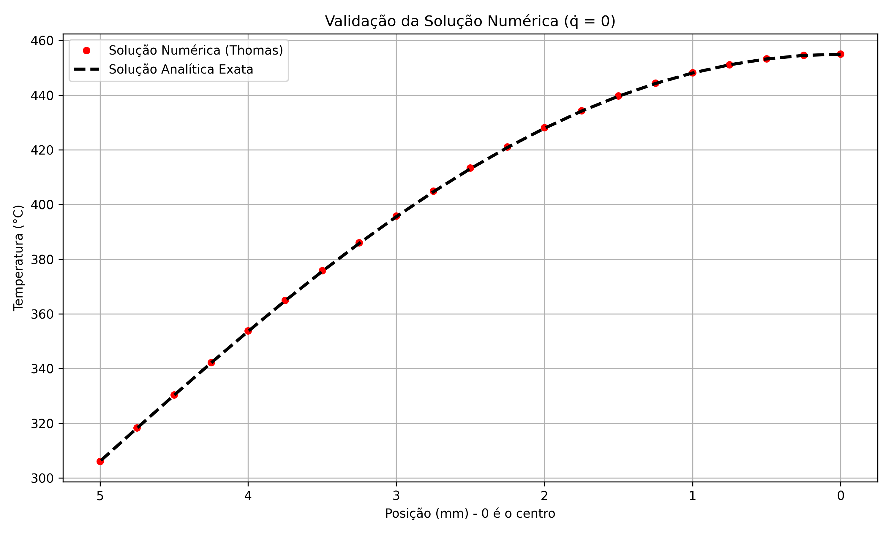

# Programa 4: Condução de Calor 1D Transiente

## Como Rodar
Precisa de Python 3 com `numpy` e `matplotlib`:

```bash
python conducao_calor_1d.py
```

O script vai rodar duas simulações (Validação e Aplicação) e salvar os resultados em `images/`.

## O Problema Físico

Imagine uma barra metálica (ou parede) onde o calor está se propagando ao longo do comprimento. A equação que descreve como a temperatura $T$ varia no espaço ($x$) e no tempo ($t$) é a **Equação da Difusão de Calor**:

$$ \frac{\partial T}{\partial t} = \alpha \frac{\partial^2 T}{\partial x^2} + S $$

Onde:
- $\alpha = k/(\rho c_p)$ é a difusividade térmica (quão rápido o calor se espalha).
- $S$ é um termo de geração interna de calor (pode ser zero ou positivo).

**Condições de contorno:**
- Centro da barra: Simétrico (sem fluxo de calor).
- Superfície: Troca calor com o ambiente por convecção.

## O Método Numérico

Usamos **Diferenças Finitas Implícitas** (esquema BTCS - Backward Time, Centered Space). A ideia é:

1. Dividir a barra em pequenos pedaços (nós espaciais).
2. Dividir o tempo em pequenos passos.
3. Em cada passo de tempo, resolver um sistema linear pra encontrar a temperatura em todos os nós.

**Por que implícito?** Porque é incondicionalmente estável. Podemos usar passos de tempo maiores sem o método "explodir" (ao contrário do método explícito, que tem limitações de estabilidade).

O sistema linear é **tridiagonal** (só tem valores na diagonal principal e nas duas adjacentes), então usamos o **Algoritmo de Thomas (TDMA)** pra resolver super rápido.

## Análise dos Resultados

### Tarefa 1: Validação (sem geração de calor)

Aqui simulamos uma barra que começa quente (500°C) e vai esfriando até atingir a temperatura do ambiente (300°C). Como não tem geração de calor ($\dot{q} = 0$), dá pra comparar com a solução analítica exata (série de Fourier infinita).



**O que o gráfico mostra:**
- Eixo X: Posição ao longo da barra (0 = centro, 5mm = superfície).
- Eixo Y: Temperatura final após 7 segundos.
- Bolinhas vermelhas: Solução numérica (método de Thomas).
- Linha tracejada preta: Solução analítica exata.

**Observações:**
- As bolinhas estão praticamente em cima da linha preta! Isso significa que o código está correto.
- A temperatura é maior no centro (mais longe do ambiente frio) e menor na superfície (onde o calor escapa).
- O erro máximo entre numérico e analítico é de apenas 0.003°C - desprezível!

**Conclusão:** O método funciona perfeitamente. Podemos confiar nele pra casos mais complexos.

### Tarefa 2: Aplicação (com geração de calor)

Agora a barra começa fria (300°C) mas tem uma fonte interna de calor ($\dot{q} = 1.5 \times 10^8$ W/m³) - imagine uma resistência elétrica ou uma reação química exotérmica.

#### Perfil de Temperatura Final


**O que o gráfico mostra:**
- Linha tracejada azul: Temperatura inicial (uniforme a 300°C).
- Linha sólida vermelha: Temperatura final após 8 segundos.

**Observações:**
- O centro da barra aqueceu muito mais (chegou a ~1550°C!) que a superfície (~1050°C).
- Isso faz sentido: o calor é gerado uniformemente, mas só consegue escapar pela superfície. O centro fica "preso" entre duas regiões que também estão quentes, então acumula mais energia.
- A diferença de 500°C entre centro e superfície mostra que tem um gradiente térmico bem forte.

#### Heatmap (Evolução Temporal)


**O que o heatmap mostra:**
- Eixo X: Tempo (0 a 8 segundos).
- Eixo Y: Posição na barra (0 = centro, 5mm = superfície).
- Cores: Temperatura (roxo = frio, amarelo/branco = quente).

**Observações:**
- No início (t=0), tudo está roxo escuro (300°C).
- Conforme o tempo passa, as cores vão ficando mais quentes (amarelo).
- O **centro** (topo do gráfico) aquece mais rápido que a **superfície** (base).
- Depois de ~6 segundos, as cores param de mudar muito - o sistema está chegando num "quase-equilíbrio" (na verdade é um regime permanente, onde a geração de calor é balanceada pela remoção na superfície).

**Interpretação física:**
Esse tipo de problema é comum em:
- Reatores nucleares (geração de calor por fissão).
- Cabos elétricos (geração de calor por efeito Joule).
- Processos químicos exotérmicos.

O heatmap ajuda a identificar **pontos quentes** que podem ser problemáticos (risco de falha do material se a temperatura passar do limite).
