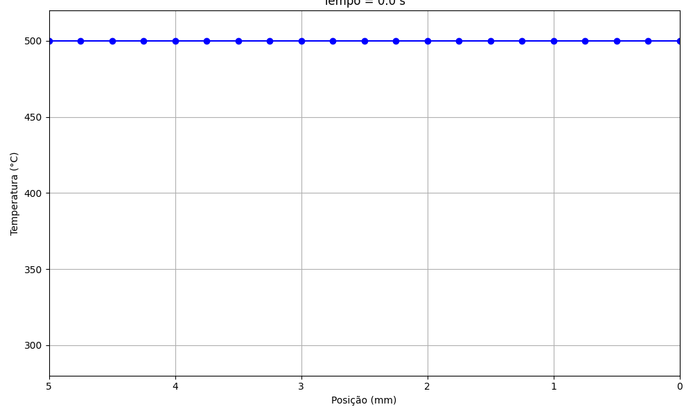
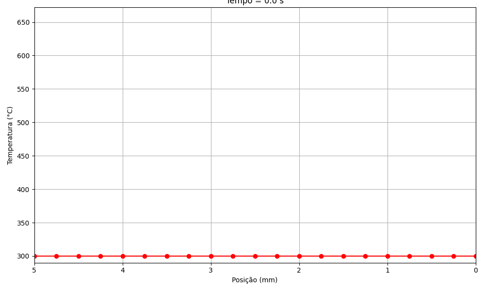

# Programa 4: Condução de Calor 1D Transiente

## Instruções de Execução
Requer Python 3 com as bibliotecas `numpy` e `matplotlib`:

```bash
python conducao_calor_1d.py
```

O script executa duas simulações (Validação e Aplicação) e salva os resultados em `images/`.

## Contextualização do Problema

Analisa-se a propagação de calor em uma barra metálica unidimensional. A evolução da temperatura $T(x,t)$ é descrita pela **Equação da Difusão de Calor** (EDP Parabólica):

$$
\frac{\partial T}{\partial t} = \alpha \frac{\partial^2 T}{\partial x^2} + S
$$

Onde:
- $\alpha = k/(\rho c_p)$: Difusividade térmica do material.
- $S$: Termo fonte de geração interna de calor.

**Condições de Contorno:**
- **Centro ($x=0$):** Adiabático (Simetria). $\partial T/\partial x = 0$.
- **Superfície ($x=L$):** Convecção com o meio ambiente.

## Metodologia Numérica

Adota-se o Método de **Diferenças Finitas Implícitas** (esquema BTCS - Backward Time, Centered Space).

1.  O domínio espacial é discretizado em nós ($i$).
2.  O domínio temporal é discretizado em passos ($n$).
3.  O sistema resultante de equações lineares é resolvido a cada passo de tempo.

**Justificativa para o método implícito:**
Este esquema é incondicionalmente estável, permitindo a utilização de passos de tempo ($\Delta t$) maiores sem incorrer em instabilidades numéricas, ao contrário dos métodos explícitos.

O sistema linear gerado possui matriz tridiagonal, sendo resolvido eficientemente pelo **Algoritmo de Thomas (TDMA)**.

## Análise dos Resultados

### Tarefa 1: Validação (Sem Geração)

Simula-se o resfriamento de uma barra (inicialmente a 500°C) até o equilíbrio com o ambiente (300°C). Com $S=0$, compara-se o resultado numérico com a solução analítica exata (Série de Fourier).


### Animação da Evolução Temporal


**Análise:**
- **Eixo X:** Posição na barra (0 = Centro, 5mm = Superfície).
- **Marcadores Vermelhos:** Solução numérica.
- **Linha Tracejada:** Solução analítica.
- Observa-se excelente concordância entre os resultados, com erro máximo desprezível ($\approx 0.003^\circ$C). Isso valida a implementação do algoritmo TDMA.

### Tarefa 2: Aplicação (Com Geração Interna)

Simula-se o aquecimento de uma barra partindo de 300°C, sujeita a uma fonte interna de calor uniforme ($\dot{q} = 1.5 \times 10^8$ W/m³).

#### Perfil de Temperatura Final


**Análise:**
- A temperatura no centro atinge valores significativamente superiores (~1550°C) à superfície (~1050°C).
- A superfície remove calor por convecção, enquanto o centro retém energia devido à simetria e à resistência térmica do material, gerando um gradiente térmico acentuado ($\Delta T \approx 500^\circ$C).

#### Heatmap (Evolução Temporal)


### Animação da Aplicação


**Descrição:**
- **Eixo X:** Tempo (s).
- **Eixo Y:** Posição espacial (Topo = Centro, Base = Superfície).
- **Cores:** Temperatura (Escala Inferno: Roxo=Frio $\to$ Amarelo=Quente).

**Análise:**
- Inicialmente (t=0), a barra encontra-se uniformemente fria (300°C - roxo).
- Com o tempo, observa-se o aquecimento progressivo, mais intenso no centro (região superior amarela).
- Após aproximadamente 6 segundos, o sistema atinge o regime permanente, onde a taxa de geração interna iguala a taxa de remoção de calor pela superfície, estabilizando as temperaturas.
