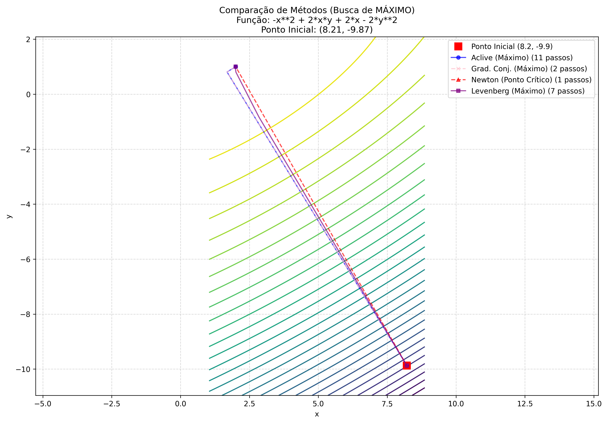

# Programa 5: Otimização Multidimensional

## 1. Pré-requisitos e Execução
Requer **Python 3** e as bibliotecas `numpy`, `sympy` (para cálculo simbólico de derivadas) e `matplotlib`.

```bash
# Como executar
python otimizacao_multidimensional.py
```

## 2. Contextualização Matemática

O problema de otimização irrestrita consiste em encontrar um vetor $\mathbf{x}^* = [x^*, y^*]^T$ que minimize (ou maximize) uma função custo escalar $f(x, y)$.
$$ \min_{x,y} f(x, y) $$

O script explora "superfícies de custo" complexas, como vales estreitos (funções de Rosenbrock-like) ou pontos de sela, onde métodos simples frequentemente falham.

## 3. Metodologia Numérica

Foram implementados quatro algoritmos clássicos para comparação:

1.  **Aclive Máximo (Steepest Descent/Ascent)**:
    *   Direção: $\mathbf{d}_k = -\nabla f(\mathbf{x}_k)$.
    *   Características: Método de primeira ordem. Robusto longe do ótimo, mas sofre de "zigue-zague" em vales estreitos, tornando a convergência lenta perto da solução.

2.  **Gradientes Conjugados (Fletcher-Reeves)**:
    *   Direção: Combinação linear do gradiente atual e da direção anterior.
    *   Características: Garante que as direções de busca sejam "conjugadas" em relação à Hessiana, "cortando caminho" pelos vales e convergindo muito mais rápido que o gradiente simples.

3.  **Método de Newton Multidimensional**:
    *   Direção: $\mathbf{d}_k = -[\mathbf{H} f(\mathbf{x}_k)]^{-1} \nabla f(\mathbf{x}_k)$.
    *   Características: Método de segunda ordem (usa curvatura/Hessiana). Convergência quadrática (extremamente rápida) perto do ótimo, mas pode divergir se o ponto inicial estiver longe ou se a Hessiana não for positiva definida.

4.  **Levenberg-Marquardt**:
    *   Direção: Interpolação entre Newton e Gradiente. $\mathbf{d}_k = -[\mathbf{H} + \lambda \mathbf{I}]^{-1} \nabla f$.
    *   Características: Se $\lambda$ é grande (longe do ótimo), comporta-se com Gradiente (robusto). Se $\lambda$ é pequeno (perto do ótimo), comporta-se como Newton (rápido).

## 4. Análise dos Resultados

O script gera um gráfico de curvas de nível da função objetivo e traça o caminho percorrido por cada método.

### Mapa de Contorno e Caminhos

*Observe como o método de Newton (se não falhar) geralmente vai direto ao ponto, enquanto o Gradiente faz curvas. O Gradiente Conjugado corrige essa ineficiência.*

### Log do Terminal
O script também exibe uma tabela comparativa com o número de passos e tempo de execução. Repare que o script possui uma **Lógica de Failover**: se ele tenta achar um mínimo e diverge (vai para infinito), ele detecta que a função pode ser côncava e reinicia a busca procurando um **Máximo**.
