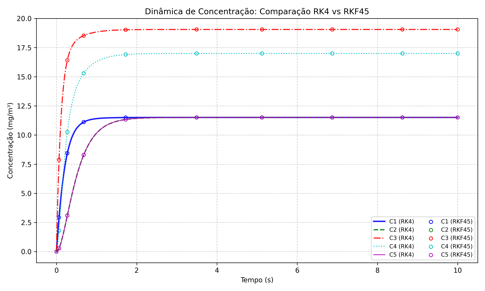

# Programa 6: Dinâmica de Reatores (EDOs)

## Como Rodar
Precisa de Python 3 com `numpy` e `matplotlib`:

```bash
python reatores_mistos.py
```

## O Problema

Ao contrário do Programa 2 (que buscava o equilíbrio), aqui a gente simula **como o reator evolui no tempo** partindo de uma condição inicial até chegar no estado estacionário.

O sistema é descrito por duas equações diferenciais ordinárias (EDOs) acopladas:

1. **Variação da Concentração:**
   $$ \frac{dC_A}{dt} = \frac{1}{\tau}(C_{A,in} - C_A) - k(T)C_A $$

2. **Variação da Temperatura:**
   $$ \frac{dT}{dt} = \frac{1}{\rho c_p} \left[ \frac{\rho c_p}{\tau}(T_e - T) + (-\Delta H)k(T)C_A - \frac{UA}{V}(T - T_c) \right] $$

Essas equações dizem: "a cada instante, como $C_A$ e $T$ estão mudando?". Integrando no tempo, descobrimos a trajetória completa.

## Os Métodos Numéricos

### RK4 (Runge-Kutta de 4ª Ordem)
O "padrão ouro" da integração numérica. A cada passo de tempo, ele:
1. Avalia a derivada em 4 pontos intermediários.
2. Faz uma média ponderada dessas derivadas.
3. Usa essa média pra atualizar a solução.

**Precisão:** Erro global de $O(\Delta t^4)$ - muito bom!

### RK45 (Runge-Kutta-Fehlberg / Embedded)
Uma versão mais sofisticada que calcula simultaneamente uma solução de 4ª e outra de 5ª ordem. A diferença entre elas dá uma estimativa do erro, permitindo (em implementações completas) ajustar o passo de tempo automaticamente.

Neste script, usamos o RK45 principalmente pra **validar** que o RK4 está funcionando bem (as duas soluções devem ser quase idênticas).

## Análise dos Resultados

### Resposta Transiente do Reator (Comparação RK4 vs RK45)


**O que estamos vendo no gráfico:**
O gráfico mostra a evolução no tempo de **5 concentrações diferentes** (C1 a C5), correspondentes à dinâmica interna do reator ou múltiplas espécies.

1.  **Linhas Sólidas Coloridas (RK4):** Representam a solução calculada pelo método Runge-Kutta clássico de 4ª ordem.
2.  **Círculos Vazios (RKF45):** "Bolinhas" plotadas em intervalos (scatter) representam a solução pelo método Embedded (Runge-Kutta-Fehlberg).

**Análise:**
- **Sobreposição:** Note que os círculos vazios caem exatamente em cima das linhas sólidas. Isso confirma que nosso RK4 simples está tão preciso quanto o método avançado para este problema.
- **Dinâmica:** Todas as concentrações partem de zero (ou valor inicial baixo) e crescem até atingir um patamar constante. Esse patamar é o **estado estacionário**.
- **Tempo de Estabilização:** O sistema leva cerca de 2-3 segundos (no tempo adimensional ou real do problema) para sair do transiente e estabilizar.

Este gráfico valida nossa implementação numérica: dois métodos diferentes deram o mesmo resultado.

